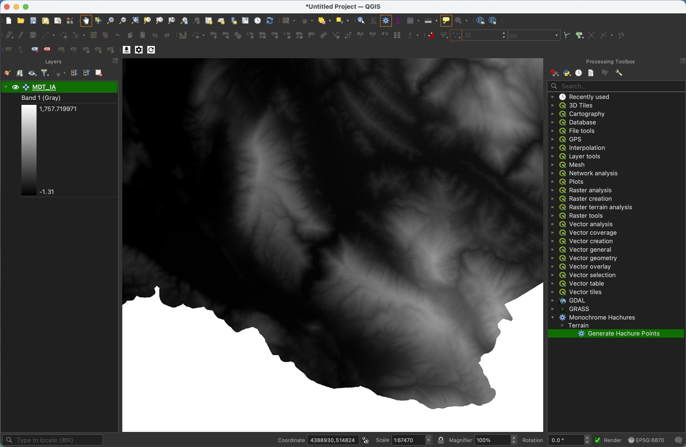
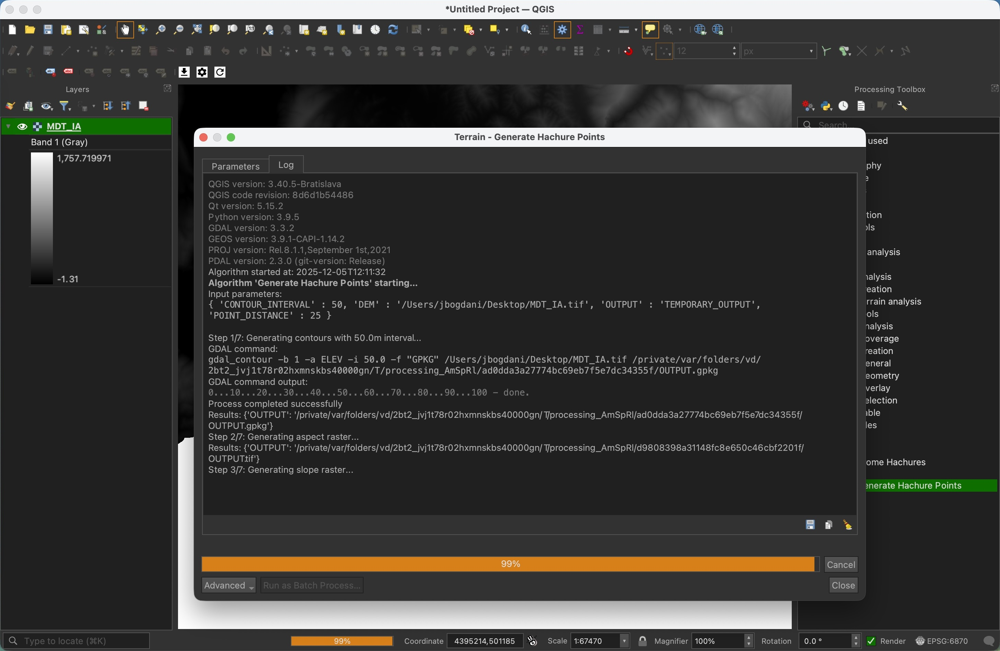
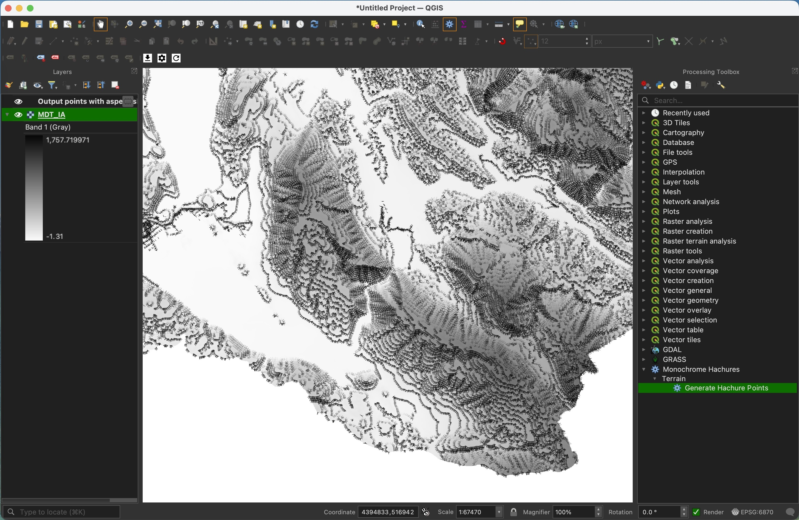
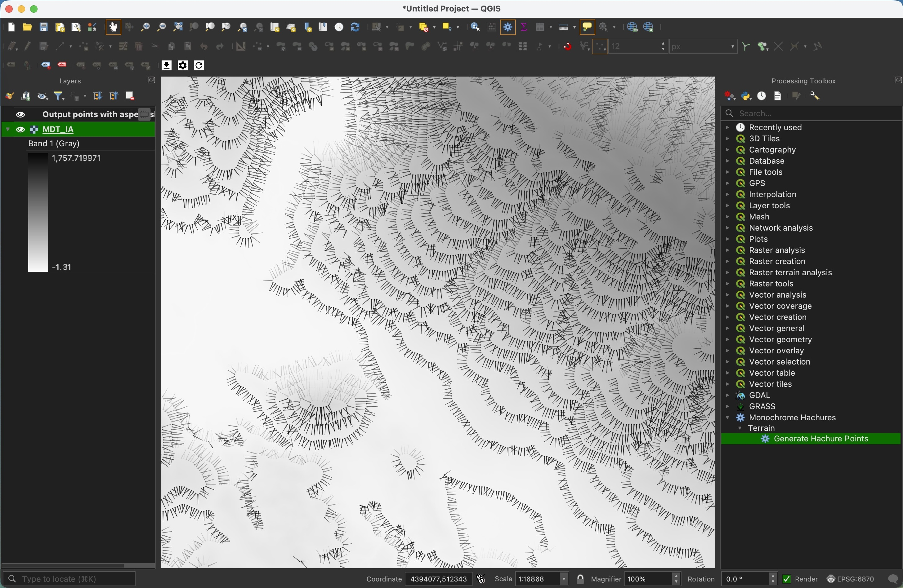
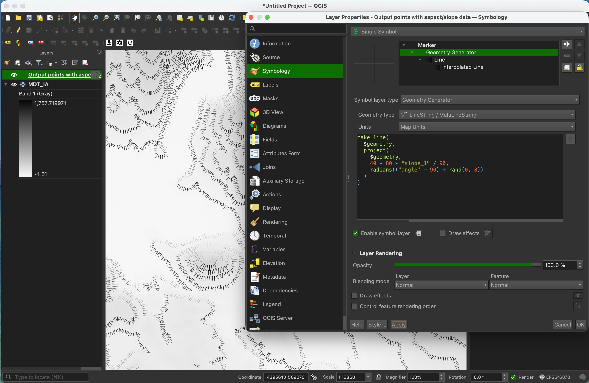
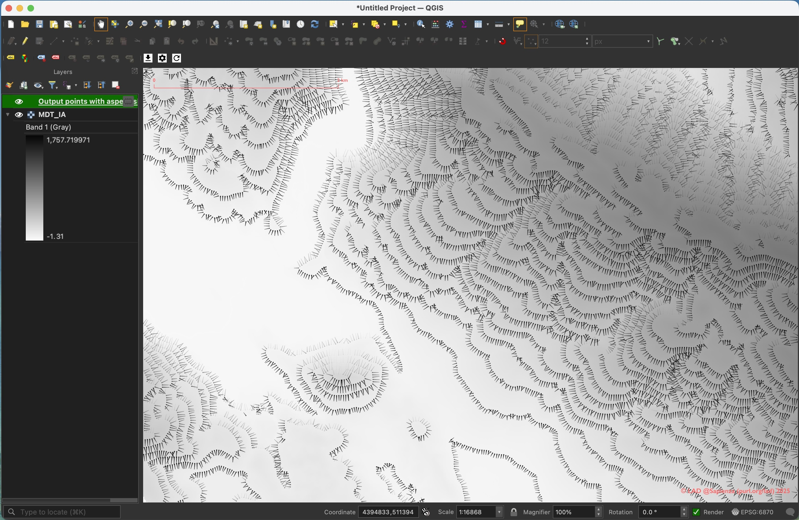
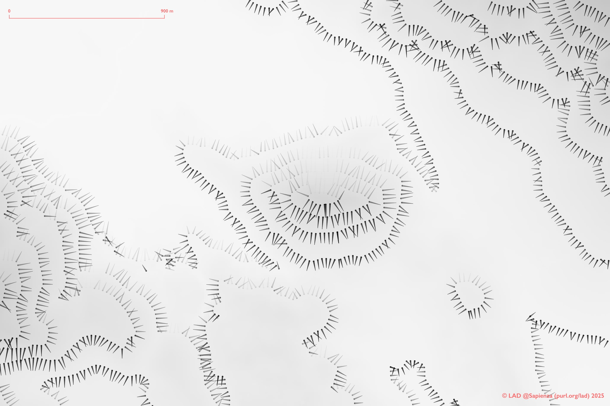

# QGIS Hachure Map Generator

  A QGIS Processing plugin that generates beautiful hachure maps from DEM data, following the methodology described in [Robin Hawkes' tutorial](https://robinhawkes.com/blog/qgis-monochrome-hachures/).

## What are Hachures?

Hachures are a cartographic technique for representing terrain relief using short lines that follow the direction of slopes. Lines are longer and more opaque on steeper slopes, creating a visually striking representation of topography.

## Preview


*Load the DEM and open Processing Toolbox*


*Edit basic settings for contour interval and point spacing*


*Run the algorithm*


*Styled result automatically loaded with default hachure visualization*


*Edit basemap style settings*


*Edit hachures style settings to customize appearance*


*Final result with minimal custom style editing*


*Detailed view of final result showing hachure lines variation*

## Features

- **Contour-based approach**: Generates contours, then places points along them
- **Automatic aspect/slope sampling**: Calculates slope and aspect data at each point
- **Pre-styled output**: Automatically applies geometry generator styling
- **Hillshade-like opacity**: Lines change opacity based on aspect (sun direction)
- **Highly customizable**: Easy to adjust line length, density, and appearance

## Installation

### From GitHub Releases (Recommended)

1. Go to the [Releases page](https://github.com/lad-sapienza/monochrome-hachures/releases)
2. Download the latest `monochrome-hachures-X.X.X.zip` file
3. In QGIS, go to **Plugins → Manage and Install Plugins → Install from ZIP**
4. Select the downloaded ZIP file and click **Install Plugin**

## Usage

1. Open QGIS Processing Toolbox
2. Navigate to: **MPonochrome Hachures → Terrain → Generate Hachure Points**
3. Select your DEM raster layer
4. Set contour interval (default: 50m)
5. Set distance between hachure points (default: 50m)
6. Run the algorithm

The output layer will be automatically styled with hachure lines!

## Customization

Open the layer properties and navigate to Symbology. The style uses a **Geometry Generator** with the following expression:

```
make_line(
  $geometry,
  project(
    $geometry,
    70 + 100 * "slope_1" / 90,
    radians(("angle" - 90) + rand(0, 8))
  )
)
```

### Adjustments

- **Line length**: Modify `70 + 100 * "slope_1" / 90` (min length + range)
- **Randomness**: Change `rand(0, 8)` to add variation to line angles
- **Sun direction**: Modify the opacity expression `100 * (1 - abs("aspect_1" - 180) / 180)`
- **Line width**: Adjust in the Simple Line settings

## Requirements

- QGIS 3.20 or later
- DEM raster in a metric projection (e.g., UTM, British National Grid)

## Credits

Developed by [Julian Bogdani](mailto:julian.bogdani@uniroma1.it) at [LAD @Sapienza](https://purl.org/lad). based on the excellent tutorial by [Robin Hawkes](https://robinhawkes.com/blog/qgis-monochrome-hachures/).

Plugin development assisted by Claude Sonnet 4.5 via GitHub Copilot.

## License

MIT License
